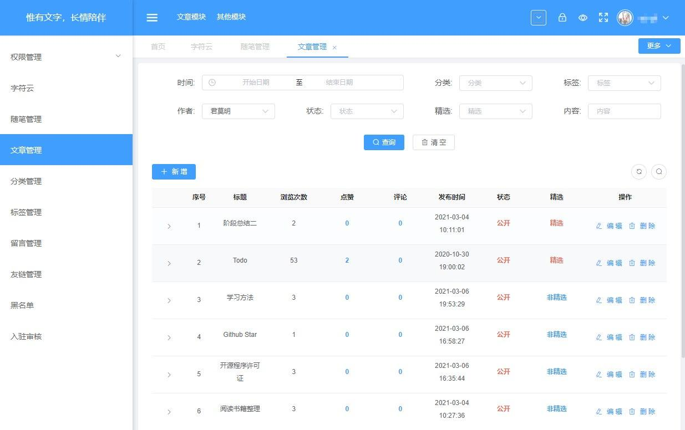

# blogAvue
>项目背景：个人博客

项目基于vue2（avue）

# 后台管理界面


[blog-avue](https://github.com/renserve/blog-avue)

## 前端
[blog-nuxt](https://github.com/renserve/blog-nuxt)

## 后台
[blog-koa](https://github.com/renserve/blog-koa)

登录账号root，密码：123456

## Run
``` bash

# 安装依赖
npm install

# 查看package.json script运行命令
npm run dev

```
### 参考项目
[avue](https://github.com/nmxiaowei/avue)
